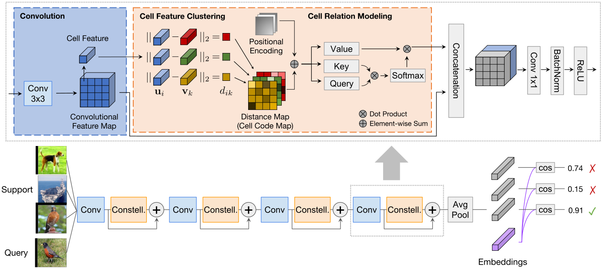

# Attentional Constellation Nets For Few-shot Learning

## Introduction
This repository contains the official code and pretrained models for [Attentional Constellation Nets For Few-shot Learning (ICLR 2021)](https://openreview.net/pdf?id=vujTf_I8Kmc). In this paper, we tackle the few-shot learning problem and make an effort to enhance structured features by expanding CNNs with a constellation model, which performs cell feature clustering and encoding with a dense part representation; the relationships among the cell features are further modeled by an attention mechanism. With the additional constellation branch to increase the awareness of object parts, our method is able to attain the advantages of the CNNs while making the overall internal representations more robust in the few-shot learning setting. Our approach attains a significant improvement over the existing methods in few-shot learning on the CIFAR-FS, FC100, and mini-ImageNet benchmarks.


For more details, please refer to [Attentional Constellation Nets For Few-shot Learning](https://openreview.net/pdf?id=vujTf_I8Kmc) by [Weijian Xu*](https://weijianxu.com/), [Yifan Xu*](https://yfxu.com/), Huaijin Wang*, and [Zhuowen Tu](https://pages.ucsd.edu/~ztu/).





## Changelog

09/17/2021: Code for ConstellationNet are released.

## Usage


### Environment Preparation
1. Set up a new conda environment and activate it.
   ```bash
   # Create an environment with Python 3.8.
   conda create -n constells python==3.8
   conda activate constells
   ```

2. Install required packages.
   ```bash
   # Install PyTorch 1.8.0 w/ CUDA 11.1.
   conda install pytorch==1.8.0 torchvision==0.9.0 torchaudio==0.8.0 cudatoolkit=11.1 -c pytorch -c conda-forge

   # Install yaml
   conda install -c anaconda pyyaml

   # Install tensorboardx.
   conda install -c conda-forge tensorboardx tqdm
   ```

### Code and Datasets Preparation
1. Clone the repo.
   ```bash
   git clone https://github.com/mlpc-ucsd/ConstellationNet.git
   cd ConstellationNet
   ```

2. Download datasets
   - [Mini-ImageNet](https://drive.google.com/file/d/1fJAK5WZTjerW7EWHHQAR9pRJVNg1T1Y7/view?usp=sharing) (courtesy of [Spyros Gidaris](https://github.com/gidariss/FewShotWithoutForgetting))
   - [CIFAR-FS](https://drive.google.com/file/d/1GjGMI0q3bgcpcB_CjI40fX54WgLPuTpS/view?usp=sharing) (courtesy of [Kwonjoon Lee](https://github.com/kjunelee/MetaOptNet))
   - [FC100](https://drive.google.com/file/d/1_ZsLyqI487NRDQhwvI7rg86FK3YAZvz1/view?usp=sharing) (courtesy of [Kwonjoon Lee](https://github.com/kjunelee/MetaOptNet))
   - [PACS](https://1drv.ms/u/s!AtQiLT3Xe-I1px6Vho4tim4AmB3i) (only photo classification)
   
   The code assumes datasets are saved according to the following structure:
   
```
 materials
├── mini-imagenet
│   ├── miniImageNet_category_split_test.pickle
│   ├── miniImageNet_category_split_train_phase_test.pickle
│   ├── miniImageNet_category_split_train_phase_train.pickle
│   ├── miniImageNet_category_split_train_phase_val.pickle
│   ├── miniImageNet_category_split_val.pickle
├── cifar-fs
│   ├── CIFAR_FS_test.pickle
│   ├── CIFAR_FS_train.pickle
│   ├── CIFAR_FS_val.pickle
├── fc100
│   ├── FC100_test.pickle
│   ├── FC100_train.pickle
│   ├── FC100_val.pickle
├── pacs
│   ├── PACS_test.pickle
│   ├── PACS_train.pickle
│   ├── PACS_val.pickle
```


### Pre-trained Checkpoints

We provide the Constellation Nets checkpoints pre-trained on the Mini-Imagenet, CIFAR-FS and FC100.


| Dataset | Model| Backbone | Acc@ 5-way 1-shot | Acc@ 5-way 5-shot| #Params | SHA-256 (first 8 chars) | URL |
| --- | --- | --- | --- | --- | --- | --- | --- |
| Mini-ImageNet | ConstellationNets | Conv-4 | 59.67 ± 0.23 | 75.98 ± 0.18 | 200K | d76075a5  | [model](https://vcl.ucsd.edu/constellation/mini_conv4/max-f-va.pth)  |
| Mini-ImageNet | ConstellationNets | ResNet-12 | 65.53 ± 0.23 | 80.55 ± 0.16 | 8.4M | cf716d90 | [model](https://vcl.ucsd.edu/constellation/mini_res12/max-f-va.pth)  |
| CIFAR-FS | ConstellationNets | Conv-4 | 69.1 ± 0.3 | 83.0 ± 0.2 | 200K | 4ea590f9 | [model](https://vcl.ucsd.edu/constellation/cifar_conv4/max-f-va.pth)  |
| CIFAR-FS | ConstellationNets | ResNet-12 | 76.1 ± 0.2 | 87.4 ± 0.2 | 8.4M | dc5d56fa|[model](https://vcl.ucsd.edu/constellation/cifar_res12/max-f-va.pth)  |
| FC100 | ConstellationNets | ResNet-12 | 43.9 ± 0.2 | 59.7 ± 0.2 | 8.4M | d9a829f7 | [model](https://vcl.ucsd.edu/constellation/fc100_res12/max-f-va.pth)|


   
### Train
   The following commands provide an example to train the Constellation Net .
   ```bash
   # Usage: bash ./scripts/train.sh [Dataset (mini, cifar-fs, fc100)] [Backbone (conv4, res12)] [GPU index] [Tag]
   bash ./scripts/train.sh mini conv4 0 trial1
   ```

### Evaluate
   The following commands provide an example to evaluate the checkpoint after training.
   ```bash
   # Usage: bash ./scripts/test.sh [Dataset (mini, cifar-fs, fc100)] [Backbone (conv4, res12)] [GPU index] [Tag]
   bash ./scripts/eval.sh mini conv4 0 trial1
   ```

## Citation
```
@inproceedings{
xu2021attentional,
title={Attentional Constellation Nets for Few-Shot Learning},
author={Weijian Xu and yifan xu and Huaijin Wang and Zhuowen Tu},
booktitle={International Conference on Learning Representations},
year={2021},
url={https://openreview.net/forum?id=vujTf_I8Kmc}
}
```

## License
This repository is released under the Apache License 2.0. License can be found in [LICENSE](LICENSE) file.

## Acknowledgment
- Thanks to [Few-shot Meta-Baseline](https://github.com/yinboc/few-shot-meta-baseline) for the implementation of [Meta-Baseline](https://arxiv.org/pdf/2003.04390.pdf)
- Thanks to [Synchronized-BatchNorm-PyTorch](https://github.com/vacancy/Synchronized-BatchNorm-PyTorch) for providing the tool to synchronize batchnorm statistics when training models with multi-GPUs.